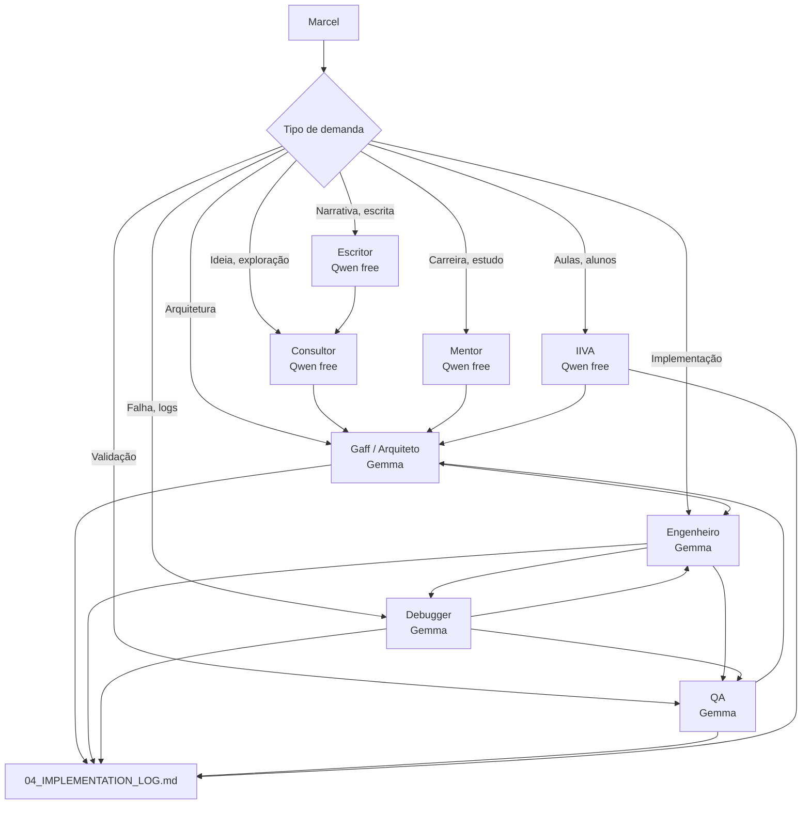

# 🛰️ 05_NEXUS_SQUAD_PROTOCOL: A CONSTITUIÇÃO SQUAD

Este documento define como a Squad Nexus se comunica e se mantém alinhada, garantindo a **Consciência Compartilhada** entre os agentes.

## 1. O Fluxo do Bastão (The Handover)

A Squad Nexus opera como uma linha de montagem técnica. Ninguém trabalha no vácuo.

| De | Para | O Que É Passado? | Canal de Passagem |
| :--- | :--- | :--- | :--- |
| **Consultor** | **Arquiteto** | O Desejo do Usuário (Ideação) + Requisitos. | Spec (Doc) + Issues (Forgejo). |
| **Arquiteto** | **Engenheiro** | O Plano Técnico (Como fazer) + Dependências. | Spec (Doc) + Config Samples. |
| **Engenheiro** | **Debugger** | O Código Implementado + Logs de Erros. | Implementation Log + Git Commits. |
| **Debugger** | **QA** | O Sistema Estabilizado + Causa Raiz de Bugs. | Relatório Técnico no Log. |
| **QA** | **Consultor/Marcel** | A Validação de Experiência (OK/NOK). | Checklist de Aprovação no Log. |

---

## 2. Mandatos de Consciência (Regras para Agentes)

### 🧩 Mandato 1: O Log é a Verdade
Antes de qualquer comando de leitura ou escrita, o agente **DEVE** ler os últimos 3 dias do `04_IMPLEMENTATION_LOG.md` no `Nexus-Docs`. Ninguém inicia uma tarefa sem saber o que o agente anterior concluuiu ou onde ele falhou.

### 🧩 Mandato 2: Registro Imediato
Nenhuma ação técnica (instalação, alteração de arquivo, restart de serviço) é considerada concluída se não for registrada no `Implementation Log`. O registro deve conter:
- **Data/Hora.**
- **Ação Realizada.**
- **Resultado (Sucesso/Erro).**
- **Arquivos Alterados.**

### 🧩 Mandato 3: Soberania Git
Toda e qualquer mudança de configuração ou código deve ser seguida de um **Git Commit** e **Git Push**.
- Servidor Privado: Forgejo (VALIS) para tudo o que for Nexus.
- Servidor Público: GitHub apenas para portfólios ADS (Java-Lab, IIVA).

### 🧩 Mandato 4: Comunicação Inter-Nós
Ao atuar em nós diferentes (PRIS, VALIS, UBIK), os agentes devem usar **SSH Interativo** (`ssh -t`) e garantir que os logs de saída de comandos críticos sejam salvos ou documentados para análise do Debugger.

### 🧩 Mandato 5: Human-in-the-Loop (HITL)
**Automações sem intervenção humana são permitidas APENAS para operações read-only.** Qualquer operação que modifique estado (escrita, deleção, restart, deploy, criação) **EXIGE aprovação explícita de Marcel Trindade**.

#### Classificação de Operações

| Tipo | Exemplos | Permissão |
|------|----------|-----------|
| **READ-ONLY** (automático) | Health checks, logs, consultas API, leitura de arquivos, listagem de containers | ✅ Sem aprovação |
| **WRITE** (requer HITL) | Criar/editar/deletar arquivos, restart de containers, deploy, criação de issues, alterações de config | ⚠️ Aprovação obrigatória |

#### Regras de Aplicação
1. **Tools:** Tools classificadas como `write` devem usar permissão `"ask"` no `opencode.json`.
2. **n8n Workflows:** Workflows que modificam estado devem incluir um nó de aprovação (webhook para Marcel) antes da ação.
3. **Agentes:** Nenhum agente pode executar operações write sem apresentar o plano e aguardar confirmação.
4. **Exceções:** Apenas Marcel pode autorizar exceções a esta regra.

---

## 3. Identidades da Squad

- **00_Consultor:** Ouve o Marcel, organiza o caos e cria a Spec inicial.
- **01_Arquiteto:** Desenha a topologia, define portas e fluxos de rede. É o dono da Spec Final.
- **02_Engenheiro:** Escreve o código, configura os containers e injeta os arquivos.
- **03_Debugger:** Analisa logs de kernel, resolve conflitos de I/O e bugs de runtime.
- **04_QA:** Testa a experiência do usuário, latência e garante que a funcionalidade é útil.
- **05_IIVA:** Mentor pedagógico para aulas de inglês.
- **06_Mentor:** Guia de carreira ADS e mentor acadêmico.

---
*Ratificado em 30 de Março de 2026. A Squad Nexus está ativa.*

## 4. O Prompt de Transição (Handover Automático)

Para garantir que o próximo agente da Squad entenda o estado atual e onde deve agir, o agente atual **DEVE** gerar um prompt formatado ao final da sessão. O Marcel copiará este prompt e o entregue à próxima Persona.

### Template Obrigatório:

> **[PROMPT DE TRANSIÇÃO SQUAD]**
> - **DE:** [Persona Atual] ➔ **PARA:** [Próxima Persona]
> - **CONTEXTO DE DOCUMENTAÇÃO:** [Caminho no Nexus-Docs/05_SYSTEM_DESIGN]
> - **O QUE FOI FEITO:** [Resumo das últimas ações]
> - **AÇÃO PENDENTE:** [O que o próximo agente deve executar]
> - **NOTAS DE SEGURANÇA:** [Riscos, volumes ou limitações identificadas]

---

## 5. Economia de Modelos e Otimização de Crédito

Este documento define a política de uso de modelos para fazer o crédito render o máximo possível.

### 5.1 Camadas de Agentes por Custo



### 5.2 Distribuição Ideal de Uso

| Camada | Agentes | Modelo | Percentual |
|--------|---------|--------|------------|
| **Barata/Frequente** | Consultor, Mentor, Escritor, IIVA | Qwen free | 70-80% |
| **Crítica/Disciplinada** | Gaff, Engenheiro, Debugger, QA | Gemma | 15-25% |
| **Fallback** | — | DeepSeek | 0-5% |

### 5.3 Regras de Escalonamento

#### Sempre comece no agente mais barato possível

| Situação | Agente Inicial |
|----------|---------------|
| Ideia solta | Consultor (Qwen) |
| Dúvida de estudo | Mentor (Qwen) |
| Aula/aluno | IIVA (Qwen) |
| Escrita criativa | Escritor (Qwen) |
| Decisão arquitetural | Gaff (Gemma) |
| Execução real | Engenheiro (Gemma) |
| Análise de logs | Debugger (Gemma) |
| Validação crítica | QA (Gemma) |

#### Escale para Gemma apenas quando:

- Decisão arquitetural
- Comando real de execução
- Análise de logs de erro
- Validação de segurança
- Mudança em banco/arquivo/sistema

### 5.4 Pipelines Recomendados

#### Fluxo técnico ideal
```
Consultor → Arquiteto → Engenheiro → QA
```

#### Quando houver falha
```
Debugger → Engenheiro → QA
```

#### Quando houver planejamento pessoal
```
Mentor → Consultor → Arquiteto (só se virar projeto real)
```

#### Quando houver conteúdo pedagógico
```
IIVA → Consultor (se quiser variações) → QA só se envolver estrutura crítica
```

#### Quando houver escrita
```
Escritor → Consultor
```

### 5.5 Parâmetros de Saída (max_output_tokens)

| Agente | Tipo | max_output_tokens |
|--------|------|------------------|
| Consultor | Criativo | 1200–1600 |
| Mentor | Criativo | 1200–1600 |
| Escritor | Criativo | 1200–1600 |
| IIVA | Criativo | 1200–1600 |
| Gaff (Arquiteto) | Técnico | 1200 |
| Engenheiro | Técnico | 1000 |
| Debugger | Técnico | 1400 |
| QA | Técnico | 1200 |

### 5.6 Temperaturas

| Agente | Tipo | Temperatura |
|--------|------|-------------|
| Consultor | Criativo | 0.85 |
| Mentor | Criativo | 0.85 |
| Escritor | Criativo | 0.9 |
| IIVA | Criativo | 0.6 |
| Gaff (Arquiteto) | Técnico | 0.2 |
| Engenheiro | Técnico | 0.1 |
| Debugger | Técnico | 0.1 |
| QA | Técnico | 0.1 |

### 5.7 Política de Fallback

#### Para agentes Gemma
```yaml
fallback:
  - deepseek/deepseek-chat
```

#### Para agentes Qwen
```yaml
fallback:
  - google/gemma-4-26b-a4b-it
```

> **Regra:** Remover o terceiro fallback em agentes críticos. Menos cascata = menos custo e menos comportamento imprevisível.

### 5.8 Mental Model Operacional

| Ação | Modelo |
|------|--------|
| Pensar aberto, explorar | Qwen |
| Decidir arquitetura | Gemma |
| Executar código | Gemma |
| Diagnosticar falha | Gemma |
| Validar resultado | Gemma |
| Conversar, ensinar, criar conteúdo | Qwen |

### 5.9 Regras Práticas para Evitar Desperdício

1. **Nunca mande contexto gigante para Gemma sem filtrar** — Resuma primeiro no Consultor ou Mentor.
2. **Logs grandes vão para o Debugger primeiro** — Evita idas e vindas caras.
3. **QA não é necessário em toda tarefa** — Use apenas em mudanças estruturais, banco, permissões, deploy, backup ou risco de regressão.
4. **IIVA e Mentor resolvem sozinhos** — Não escale desnecessariamente.
5. **Peça respostas curtas em agentes técnicos** — Checklist, plano curto, próximos passos, diagnóstico em 3 blocos.

### 5.10 Vilões do Crédito

O maior gasto NÃO vem do número de agentes. Vem de:

- Chamar Gemma à toa (sem necessidade real)
- Mandar contexto bruto demais (sem filtrar)
- Pedir respostas muito longas em agentes técnicos
- Ficar ciclando entre Engenheiro/Debugger/QA sem filtrar primeiro

---
*Ratificado em 04 de Abril de 2026. Economia de crédito ativada.*
